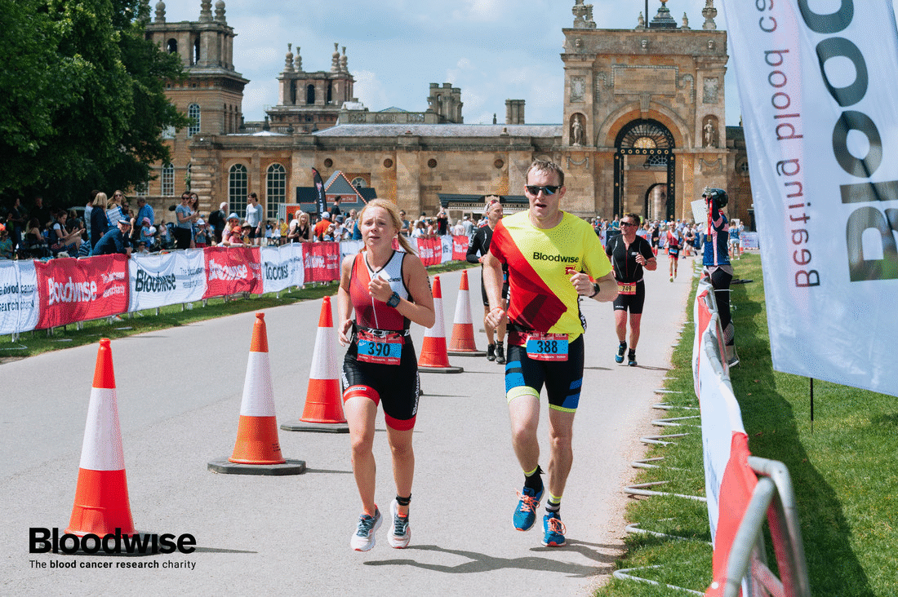

# Athletes number plate recognition
An algorithm that helps detect athletes number plates and recognize them
## Solution algorithm:
1. Detecting  face, profile of face and athlete's  body
2. Selection of estimated number plate areas
3. Character finding. Segmentation and grouping characters areas
4. Recognizing received character sets

## Technologies that have been applied
* `OpenCV` for detecting  face, profile of face and athlete's  body, selection of estimated number plate areas, segmentation and grouping characters areas
* `Stroke Width Transform` and `Tesseract` to find the area that contains characters
* `Custom CNN` for character recognition

## Demonstration of the developed algorithm

